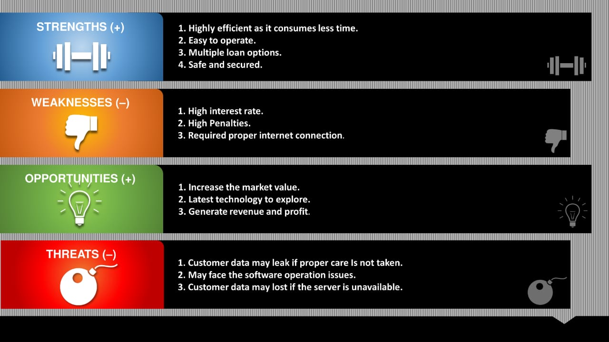

# sdlc-team-17

# INTRODUCTION

Loan management systems helps to automate the entire loan lifecycle. Depending on requirements, these programs can assist our life. The software can help with processing customer information, create new loans, and more. They can also provide lenders with accurate statements and reports. Moreover, they can manage interest rates and provide the tools for collection automation.
## Features of a loan management system:
### Loan Origination:
Loan origination is the process where a borrower applies for a loan, and the lender processes it. 
#### Loan Servicing:
The loan servicing feature helps to manage loans. Every loan is different: they have different interest rates, payment dates, and more. One can track all these loans and ensure to receive payments on time. It allows to calculate interests, fees, and more.
###  Debt collection:
Collecting back the payment is essential for lending businesses. A digital lending platform can notify you when accounts become delinquent. One can also get notified when the borrower pays back or when a repayment is due. The collection system can even calculate late fees for you.
## Benefits of a loan management system:
### Make lending easier:

Borrowers may need to borrow money for once. It is particularly true in the case of mortgages – where we have only one chance to make a good impression. Therefore, we have to provide our customer with a good lending experience. One can impart a good borrowing experience by making the application procedure online. On the operations front, we can automate credibility checks, automate the offer generation system, and make disbursal faster. 
Customers with better experiences are more likely to recommend your business to others. Recommendations like these will create new opportunities. Digital lending platforms are customer-centric systems. With self-serve portals, you can simplify the borrower journey and impress customers, especially the newer generation. 
Paperless processes:
As loan processing becomes more digital, document management has also become automated. Lenders no longer need to store files in large cabinets as everything is now centrally and digitally managed. We can view any file with a few clicks, and nothing ever gets lost.

----
## State of art:
### Ageing - Time:
In traditional lending system , the process of lending loan is chaotic. It takes a large amount of time and resource for a person who wants to avail the loan facilitie.
In this loan management system one can easily be provided with loan. Client should check his eligibilty whether he mets the criterai to get loan and then  is approved or denied loan.

### Ageing - cost/feature evolution:

The system provides feature where user can get an information of what is the amount to be paid as an interest for the amount taken.
He can also get information regarding in how many installments and within which period all the debts to be covered and much more.

----
## Identify Requirements

### Software Requirements:

1. User shall be able to enter his customer details.
2. User shall be able to view the different types of loans and can opt accordingly.
3. User shall be able to upload his necessary documents for the approval of laon.
4. User shall be able to view the cash details that he needs to pay etc.

### User Requirements:
1. able to enter his/her data into the system.
2. view the payable interest.
3. view loan EMI.
4. view the total payable amount for the kind of loan he opted for (i.e, interest+principal)
5. view the necessary documents required for applying to the loan.
6.view the different types of loan provided by the system.

### Non-Functional requirement:

1. Reliable.
2. Usable.
3. Accuracy.
4. Efficiency.

## 4 W’s and 1 H’s:

### Why:
This application is used to find if the person has taken any loan previously or not.
It is used to check the cibil score of the person.
It is used to show if the person is eligible for the loan or not.
It is used to calculate the total amount the person has to pay.

### What:
This application will check if the person has taken any loan previously or not.
It will add new customers to the database.
It will check the cibil score of the person.
It will check if the person is eligible for the loan or not.
It will check if the person is entering the correct data or not.

### When:
If an individual can't meet certain finacial condition, he/she could use this application to get a loan.Some examples are:
1.For educational purposes
2.For starting a new business
3.For improving personal life(house/car/agriculture).

### Where:
This application is deployed by the banks.
It can be accessed by users from anywhere, provided that they could meet certain criteria.

### How:
If the customer is old, it is done with the help of their cibil score.
If the customer is new, it is done with the help of their age and annual income.

## SWOT analysis:

## High Level Requirements: 
| ID | Description | Category | Status | 
| ----- | ----- | ------- | ---------|
| HR01 | A user must know to call every function. | Techincal | IMPLEMENTED | 
| HR02 | User must know the number of arguments and the arguments itself to be passed during the function call. | Techincal |  IMPLEMENTED  |
| HR03 | User must be familiar with executing C codes in his/her own machine. | Techincal |  IMPLEMENTED  |
| HR04 | User must be familiar with reading and writing files in C language if looking for storing data. | Techincal |  IMPLEMENTED  |

##  Low level Requirements:
 
| ID | Description | Category | Status (Implemented/Future) |
| ------ | --------- | ------ | ----- |
| LR01 | User must have knowledge about various type of loans. | Scenario | FUTURE |                                                                            
| LR02 | User must have knowledge about c language.| Scenario | FUTURE |
| LR03 | User must have idea of open-source codes | Scenario | FUTURE |                                                                                            
| LR04 | User must have idea of Git and GitHub. | Scenario | FUTURE |                                                                                            
